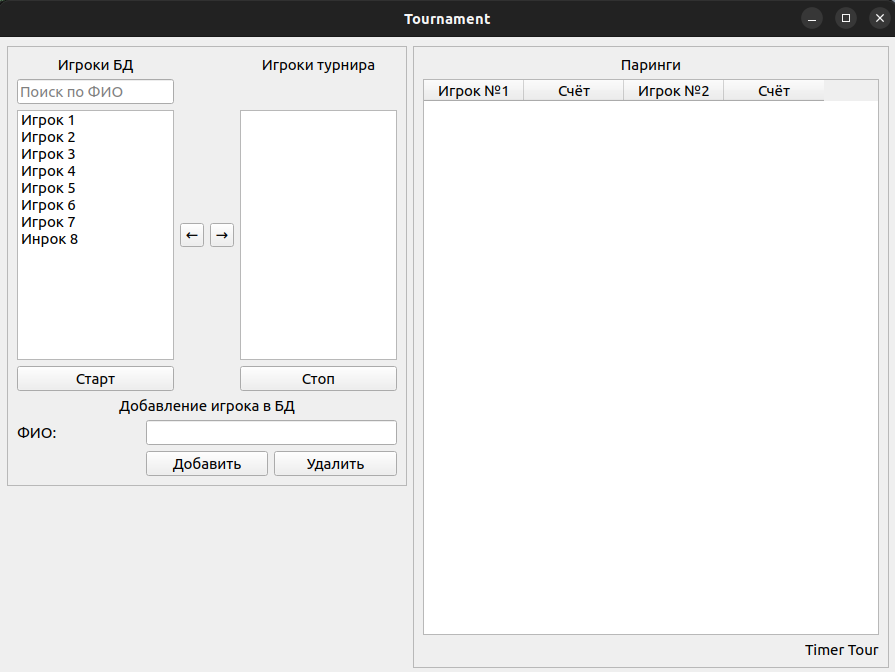
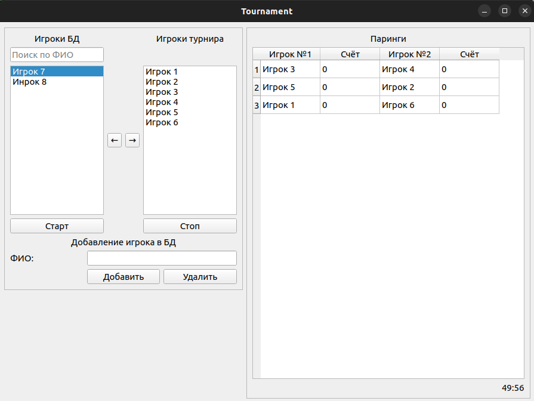

# Tournament 0.3

## О проекте

### Описание

Целью проекта является создание кросплатформенного приложения для 
парингов турниров по швейцарской системе.

### Технологии

- Python 3.10.9
- PyQt5
- SQLite

## Пример работы приложения

 
Окно после запуска программы.
 

 
Первый тур.
 